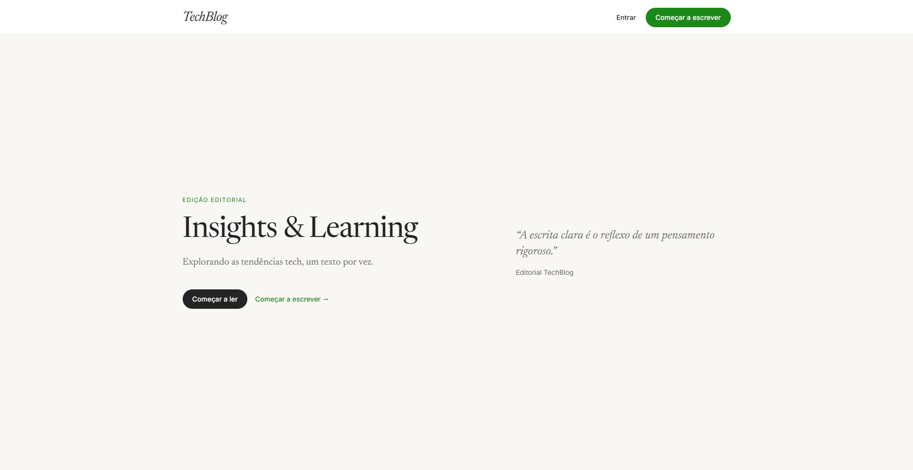
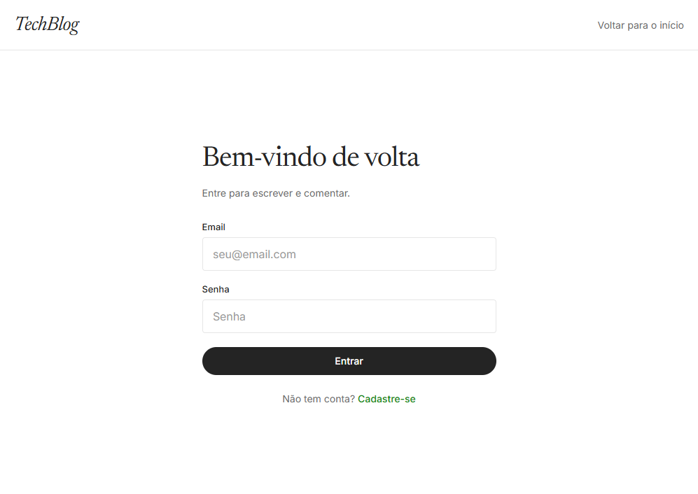
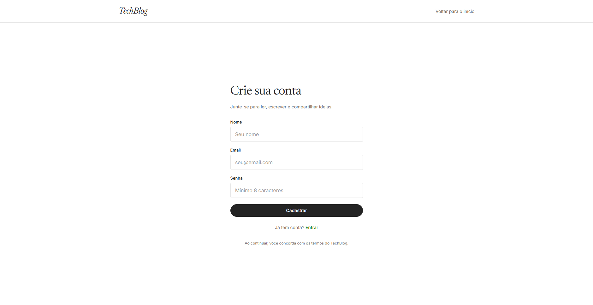
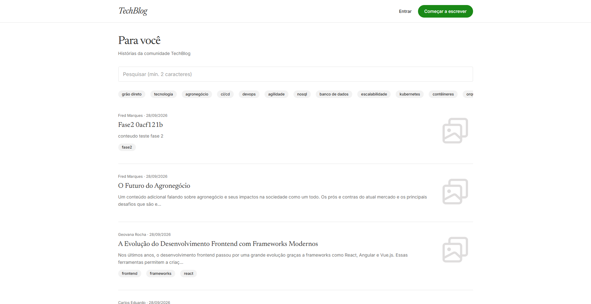
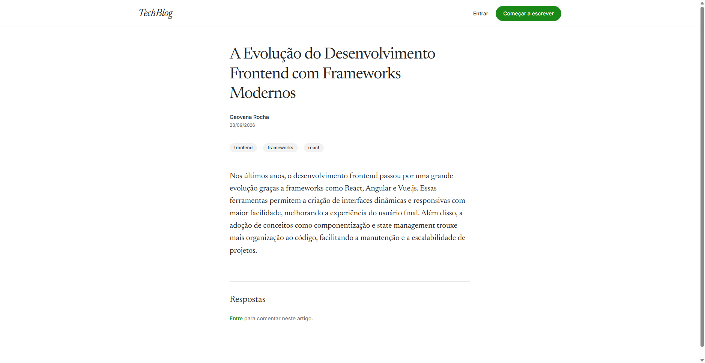
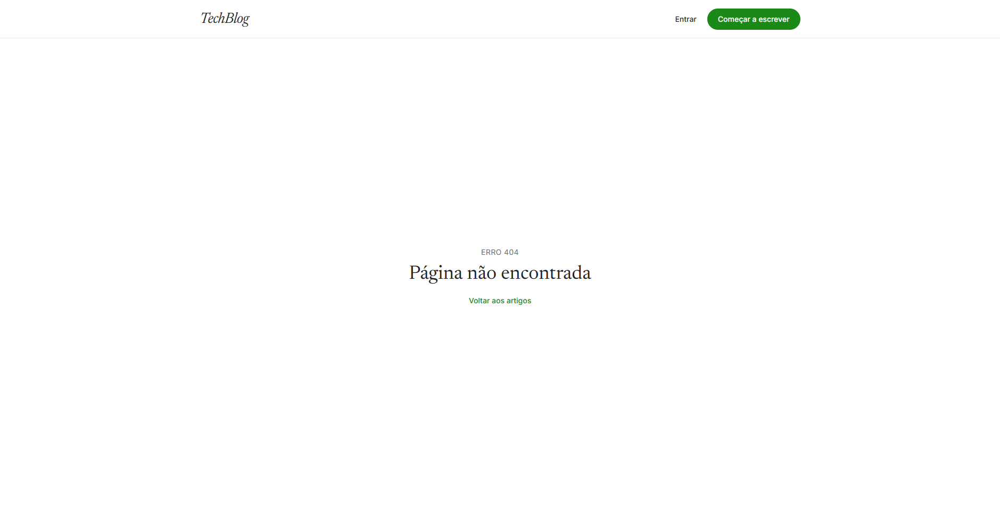
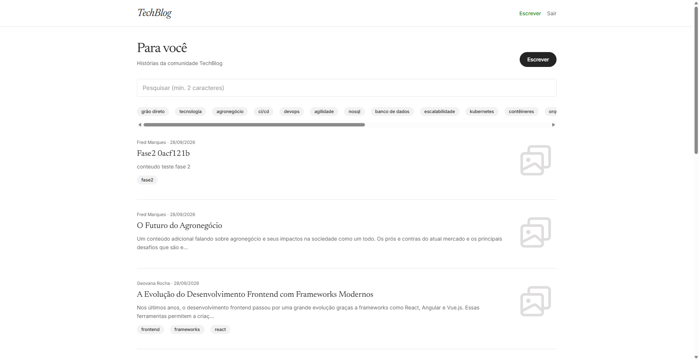
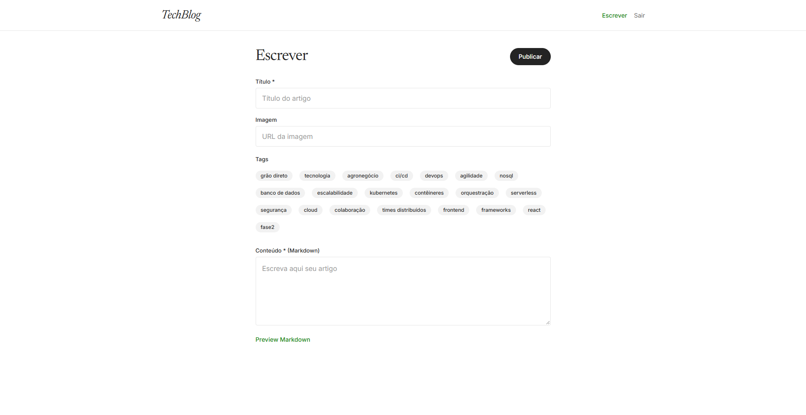
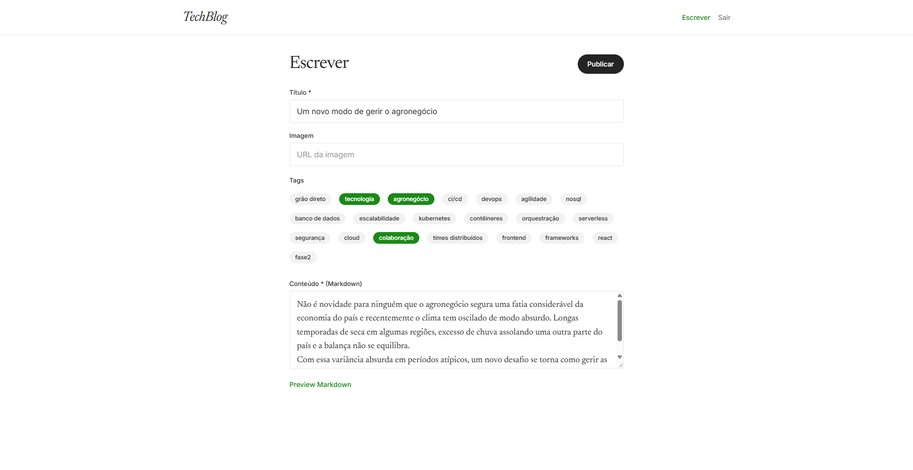
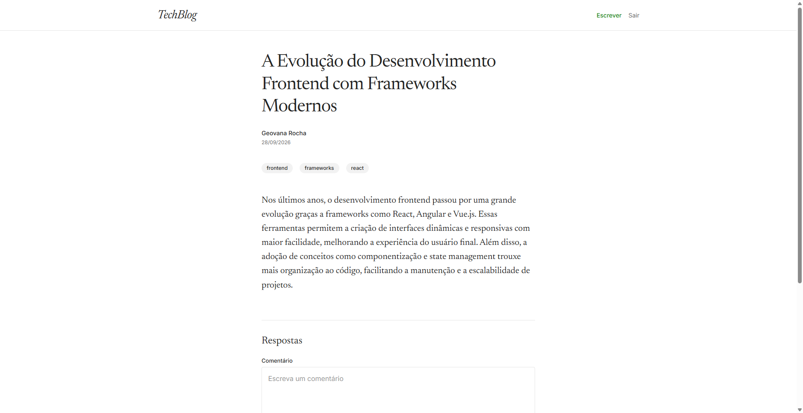

# Telas da aplicação

Capturas do frontend editorial do TechBlog (`http://localhost:5173`), usadas como referência visual da UI. Arquivos em [`docs/screenshots/`](../screenshots/).

Leitura de artigos, feed e tags é **pública**. Escrever, editar, excluir e comentar exigem login.

## Mapa de rotas

| Tela | Rota | Acesso |
|---|---|---|
| Home | `/` | Público |
| Login | `/login` | Público |
| Cadastro | `/login/register` | Público |
| Feed | `/articles` | Público (ações de autor se autenticado) |
| Leitura | `/articles/:id` | Público (comentários se autenticado) |
| Novo artigo | `/articles/new` | Autenticado |
| Editar artigo | `/articles/:id/edit` | Autenticado (autor) |
| 404 | qualquer rota inexistente | Público |

---

## Home

Landing editorial em tela cheia, abaixo do header de 72px.

## Login

Entrada da área autenticada. Credenciais seed: `{primeiro}{segundo}@teste.com` / `teste` (ex.: `fredmarques@teste.com`).

## Cadastro

Criação de conta. Após sucesso, redireciona para o login.

## Feed (visitante)

Lista pública com busca (mín. 2 caracteres), tags e paginação. Sem botões de editar/excluir.

## Leitura (visitante)

Coluna de leitura ~680px. Visitante vê o artigo e o convite para entrar e comentar.

## Página não encontrada

## Feed (autenticado)

Header com **Escrever** / **Sair**. Artigos do autor atual mostram **Editar** e **Excluir**.

## Novo artigo

Editor Markdown com tags, URL de imagem e preview.

## Editar artigo

Mesmo formulário, pré-preenchido. Disponível só para o autor.

## Leitura (autenticado)

Autor vê **Editar** / **Excluir**. Qualquer usuário logado vê o campo de comentário.

